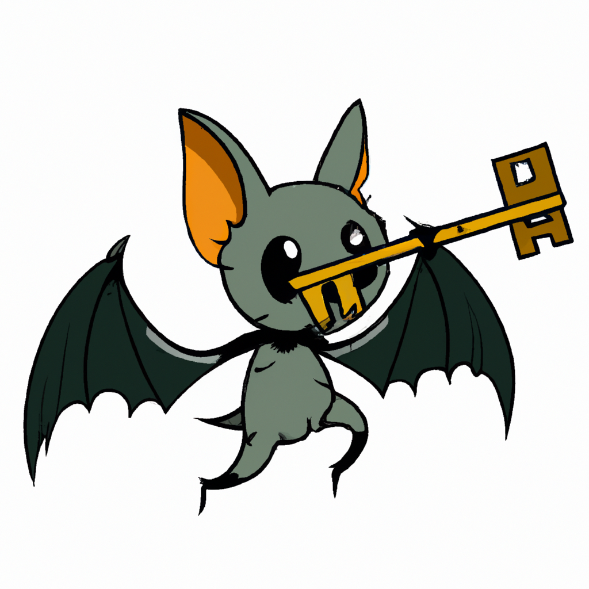

# Swecho - Swagger Input Copy Chrome Extension

Swecho (Swagger + Echo) is a Central American bat, and a firend, and also a Chrome extension designed to enhance your experience with Swagger pages. With Swecho, you can easily synchronize input values across matching fields on Swagger pages, ensuring consistency and saving time.

_Caption: i copy your key!_

## Installation

### Prerequisites

- Google Chrome browser

### Steps

1. Download the Extension: Clone or download the Swecho repository to your local machine.
1. Open Chrome Extensions Page: In your Chrome browser, go to chrome://extensions/.
1. Enable Developer Mode: On the top right corner of the extensions page, toggle on the "Developer mode" switch.
1. Load the Extension: Click on the "Load unpacked" button on the top left. Navigate to the directory where you downloaded/cloned the Swecho repository and select it.
1. Confirmation: You should now see the Swecho extension icon in your Chrome toolbar, indicating that the extension has been successfully installed.

## Usage

### Setting Up

1. Access the Popup: Click on the Swecho icon in your Chrome toolbar to open the extension popup.
1. Configure Hotkey: By default, the hotkey to synchronize input values is set to Ctrl + Shift + C. If you wish to change the character (e.g., to D for Ctrl + Shift + D), simply enter the desired character in the input field within the popup and click "Save".

### Using Swecho on Swagger Pages

1. Navigate to a Swagger Page: Ensure that the page has the structure <body>
.
1. Input Synchronization: Whenever you input a value into a field on the Swagger page, Swecho will automatically synchronize this value to other matching fields.
1. Manual Synchronization with Hotkey: If a new input field becomes available or is enabled, you can manually synchronize it with a matching field that has content. Simply focus on the new input field and press the hotkey (e.g., Ctrl + Shift + C). The value from the first matching field with content will be copied to the currently focused field.

## Troubleshooting

- If the popup displays "This is not a Swagger page", it means Swecho has detected that the current page is not a valid Swagger page and will not perform any synchronization actions.
- Ensure that the hotkey character is set correctly in the popup settings.

## Feedback and Support

If you encounter any issues or have suggestions for improvements, please open an [issue on our GitHub repository](https://github.com/cortfritz/swecho/issues).
